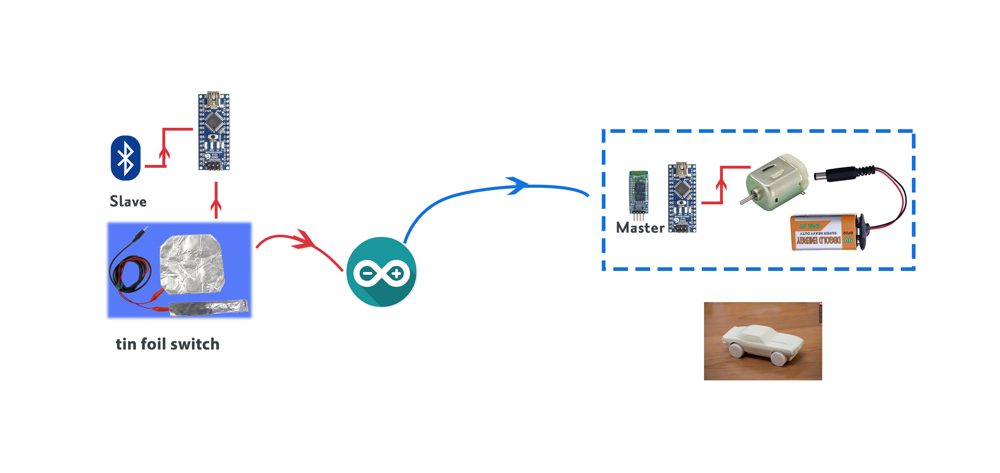

# Warm-Christmas

### What is Warm Christmas?

The story begins with a letter. Once I went to the supermarket, there was a letter in the supermarket brochure, the letter was to help homeless people have a warm Christmas. So would you like to spend one pound to buy chocolate and send it to them?

I simulated a scene in which when you put in one pound coin, press the switch and the machine will drop a chocolate into the minivan below.  This principle comes from vending machines.  I need more people to participate. I set up a group of three people and put in three coins to trigger the switch once.

### How does it work?

The control panel is connected to the car. The car receives the signal from the control panel and starts to move. When it runs for ten seconds, the control panel stops the car and sends it to its destination, bringing chocolate to homeless people.

